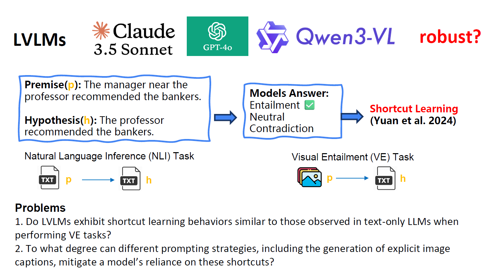

# Investigating Shortcut Learning in Vision–Language Models for Visual Entailment 

This repository contains the program code and project framework for the paper "Investigating Shortcut Learning in Vision–Language Models for Visual Entailment". 
The project evaluates how modern Large Vision-Language Models (LVLMs) process adversarial text modifications (tautologies) when performing Visual Entailment (VE) tasks, examining whether classifications are driven by superficial text-based shortcuts learning or genuine cross-modal grounding. 

## Abstract
Tasks requiring the integration of textual and visual information are now ubiquitous,
driving a massive surge of interest in Large Vision-Language Models (LVLMs), which
have demonstrated astonishing capabilities across a wide range of multimodal tasks.
However, these models frequently rely on dataset biases for prediction, a tendency that
can significantly impair their robustness and generalization capabilities. In this study, the Visual Entailment task is deployed to four LVLMs to test whether they can overcome Shortcut Learning. They are instructed to classify the relationship between a visual premise and a textual hypothesis into one of the three classes: Entailment, Neutral, or Contradiction. The constructed evaluation benchmarks include a Reference Dataset and six Perturbed Datasets with intentionally injected Shortcut Cues of different types. Comparing models’ performance on these datasets gives clear hint whether they rely on Shortcut Learning. To mitigate the potential Shortcut Learning effect, four prompting strategies are evaluated: standard zero-shot, Caption-Enhanced zero-shot, few-shot In-Context Learning (ICL), and zero-shot Chain-of-Thought (cot_zero_shot). Experiment results show several key findings, demonstrating first that LVLMs exhibit a pervasive reliance on Shortcut Cues, which leads to a obvious degradation in their performance. Second, the position, length, and content of the inserted Shortcut Cues actively determine the severity of the model’s performance drop. Third, generating a detailed caption of the visual premise fails to obviously mitigate the extend of Shortcut Learning. Furthermore, despite good scored image understanding according to a caption evaluating metric, the models tend to rely more on textual Shortcut Cues, suppressing valid visual features. Fourth, under few-shot ICL strategy, models show
lowest performance decrease (Drop range 0%-13%), better than zero-shot cot_zero_shot strategy
(Drop range 9%-32%). Finally, qualitative analysis of reasoning chains per model highlights three error types: Incorrect target object, syntactic confusion, and logical disconnect.




## ⚡ Quick Requirements

**Python Versions Required:**
- **Environment 1 (Molmo + CLIPScore):** Python 3.11
- **Environment 2 (Other Models: Qwen, Gemma, LLaVA-OV):** Python 3.11+ (recommend 3.11 for consistency)

## 💻 Hardware Requirements

For running this project on a local GPU, ensure you have:

- **GPU VRAM:** Minimum 24GB (required for loading LVLMs)
  - 2 models with ~4B parameters each
  - 2 models with ~8B parameters each
- **System RAM:** Minimum 24GB recommended for smooth operation
- **GPU:** NVIDIA GPU with CUDA 12.0+ support

**Note:** The original experiments were run on a remote cluster with SLURM. Local GPU setups are supported and require adjusting the provided `.sh` scripts.

## 📋 Readme Structure

* Hardware 
* Environment Setup and Installation
* Model Evaluation Pipeline 
* Running the Scripts Locally
* Evaluation Metrics (CLIPScore for Caption Quality)
* Data Structure

## Environment Setup

This project requires two distinct environments depending on the task you want to execute:
- **Environment 1:** Molmo + CLIPScore metric evaluation
- **Environment 2:** Other Vision-Language Models (Qwen, Gemma, LLaVA-OV)

### Prerequisites
Ensure you have [Miniconda/Anaconda](https://docs.conda.io/) or `pip` installed on your system.

---

### 🐍 Environment 1: molmo_and_clipscore
Handles Molmo 4B model evaluation and CLIPScore caption evaluation metric.

**Setup via Conda (Recommended):**
```bash
# Create the environment from the provided yml file
conda env create -f env_molmo_and_clipscore.yml

# Activate the environment
conda activate molmo_and_clipscore
```

### 🌐 Environment 2: transformer530
Handles evaluation of Qwen, Gemma, and LLaVA-OV models.

**Setup via Pip:**
```bash
# 1. Create a new virtual environment
python -m venv transformer530

# 2. Activate the environment
# On Linux/macOS:
source transformer530/bin/activate
# On Windows:
transformer530\Scripts\activate

# 3. Install the required packages
pip install -r env_other_models.txt
```

### HuggingFace Model Caching (Important)

To efficiently manage model downloads and caching, set the `HF_HOME` environment variable before running scripts:

```bash
# On Linux/macOS (add to ~/.bashrc or ~/.zshrc for persistence):
export HF_HOME="/path/to/your/model/cache"

# On Windows PowerShell:
$env:HF_HOME = "C:\path\to\your\model\cache"

# Example with external storage (recommended for large models):
export HF_HOME="/mnt/external_drive/hf_models"
```

**Recommendation:** Use external storage (external SSD/HDD) since individual models can be 4-15GB.

---

## 🔄 Model Evaluation Pipeline

This project evaluates four Large Vision-Language Models (LVLMs) on the **Visual Entailment (VE) task** to investigate shortcut learning behavior. The evaluation pipeline consists of:

### Task Overview

The Visual Entailment task requires models to classify the relationship between a visual premise (image) and a textual hypothesis into three classes:
- **Entailment:** The hypothesis is TRUE based on visual evidence
- **Contradiction:** The hypothesis is FALSE based on visual evidence  
- **Neutral:** Insufficient visual cues to determine truth value

### Evaluation Benchmarks

The evaluation includes:
- **1 Reference Dataset:** Clean e-ViL dataset (original)
- **6 Perturbed Datasets:** Datasets with injected shortcut cues (Tautologies):
  - Negation (e.g., "X is not Y")
  - Position modifications (start/end of hypothesis)

Comparing model performance across these datasets reveals whether models rely on superficial shortcuts or genuine visual understanding.

### Prompting Strategies

Four strategies are evaluated to mitigate shortcut learning:

1. **Zero-Shot (Standard):** Direct classification without examples
2. **Caption-Enhanced Zero-Shot:** Model generates detailed image captions before classification
3. **Few-Shot In-Context Learning (ICL):** Providing 3-5 labeled examples before classification
4. **Zero-Shot Chain-of-Thought (cot_zero_shot):** Model performs step-by-step reasoning before classification

**Key Findings:**
- Few-shot ICL shows best shortcut resistance (0%-13% performance drop)
- Zero-shot cot_zero_shot shows moderate resistance (9%-32% performance drop)
- Caption generation alone does not effectively mitigate shortcut reliance
- Models prefer textual shortcuts over visual features despite good image understanding

### Models Evaluated

| Model | Parameters | Environment | Script |
|-------|-----------|-------------|--------|
| Molmo | 4B | Environment 1 | `molmo.sh` / `src/evaluate_molmo2.py` |
| Qwen-VL | 8B | Environment 2 | `qwen.sh` / `src/evaluate_other_models.py` |
| Gemma Vision | 4B | Environment 2 | `gemma.sh` / `src/evaluate_other_models.py` |
| LLaVA-OV | 8B | Environment 2 | `llavaov.sh` / `src/evaluate_other_models.py` |

### Pipeline Components

1. **Model Evaluation** (`src/evaluate_molmo2.py` / `src/evaluate_other_models.py`):
   - Loads model and image dataset
   - Applies selected prompting strategy
   - Classifies hypothesis for each image
   - Computes accuracy and metrics
   - Saves predictions to CSV

2. **Caption Generation** (`src/caption_prompt_other_models.py`):
   - For caption-enhanced strategy: generates detailed image descriptions
   - Evaluates using CLIPScore metric (image-caption alignment)
   - Used as intermediate step before VE classification

3. **Caption Evaluation** (`src/caption_evaluation_clipscore/clipscore.py`):
   - Computes CLIPScore for generated captions vs. images
   - Uses Jina-CLIP v2 model for semantic alignment
   - Provides quality assessment of caption generation

---

## 🚀 Running the Scripts Locally

The provided `.sh` scripts are configured for remote SLURM cluster execution. Here's how to adapt them for local GPU execution:

### Option 1: Direct Python Execution (Recommended for Single Runs)

**For Molmo evaluation:**
```bash
# Activate environment
conda activate molmo_and_clipscore

# Set HF_HOME
export HF_HOME="/path/to/model/cache"

# Run evaluation
cd src
python evaluate_molmo2.py \
  --dataset ../data/dataset/data/esnlive.csv \
  --image_dir /path/to/flickr30k/images \
  --strategy zero_shot \
  --variation original \
  --output ../data/output/molmo/zero_shot_original.csv
```

**For other models (Qwen, Gemma, LLaVA-OV):**
```bash
# Activate environment
source transformer530/bin/activate

# Set HF_HOME
export HF_HOME="/path/to/model/cache"

# Run evaluation
cd src
python evaluate_other_models.py \
  --dataset ../data/dataset/data/esnlive.csv \
  --image_dir /path/to/flickr30k/images \
  --model qwen \
  --strategy zero_shot \
  --variation original \
  --output ../data/output/qwen/zero_shot_original.csv
```

### Option 2: Modify Shell Scripts for Local Execution

Edit each `.sh` file (e.g., `molmo.sh`, `qwen.sh`) and:

1. **Remove SLURM directives** (lines starting with `#SBATCH`)
2. **Update paths** to match your local setup:
```bash
#!/bin/bash

# Remove these lines:
# #SBATCH --job-name="evaluate_models"
# #SBATCH --partition=Abaki
# ... etc

# Update paths:
export HF_HOME="/path/to/your/model/cache"
export DATASET_DIR="/path/to/flickr30k/images"

# For Molmo:
python3 -u src/evaluate_molmo2.py \
  --dataset data/dataset/data/esnlive.csv \
  --image_dir $DATASET_DIR \
  --strategy zero_shot \
  --variation original \
  --output data/output/molmo/zero_shot_original.csv

# Then run:
bash molmo.sh
```

### Option 3: Batch Processing Multiple Experiments

Create a local batch script:

```bash
#!/bin/bash

export HF_HOME="/path/to/model/cache"
DATASET_DIR="/path/to/flickr30k/images"

# Activate correct environment
conda activate molmo_and_clipscore

# Run all Molmo variations
for strategy in zero_shot few_shot cot_zero_shot; do
  for variation in original negation start end; do
    python3 src/evaluate_molmo2.py \
      --dataset data/dataset/data/esnlive.csv \
      --image_dir $DATASET_DIR \
      --strategy $strategy \
      --variation $variation \
      --output data/output/molmo/${strategy}_${variation}.csv
  done
done

# Switch to other environment
conda deactivate
source transformer530/bin/activate

# Run all models
for model in qwen gemma llavaov; do
  for strategy in zero_shot few_shot cot_zero_shot; do
    for variation in original negation start end; do
      python3 src/evaluate_other_models.py \
        --dataset data/dataset/data/esnlive.csv \
        --image_dir $DATASET_DIR \
        --model $model \
        --strategy $strategy \
        --variation original \
        --output data/output/${model}/${strategy}.csv
    done
  done
done
```

### Command Line Arguments

**evaluate_molmo2.py / evaluate_other_models.py:**
- `--dataset`: Path to CSV file with e-ViL data
- `--image_dir`: Directory containing Flickr30k images
- `--strategy`: Prompting strategy (zero_shot / few_shot / cot_zero_shot )
- `--variation`: Dataset variation (original / negation / start / end)
- `--model`: Model name for `evaluate_other_models.py` (qwen / gemma / llavaov)
- `--output`: Output CSV path for predictions and metrics

**caption_evaluation_clipscore/clipscore.py:**
- Scans `e-ViL/tmp_data/` directory for CSVs with `generated_caption` column
- Computes CLIPScore and saves results to output CSV
- Requires images specified in `Flickr30kID` column

---

## 📊 Data Structure

```
data/
├── dataset/              # Main evaluation datasets
│   └── data/
│       ├── esnlive.csv  # Reference dataset (original)
│       ├── esnlive_negation_*.csv
│       ├── esnlive_position_start_*.csv
│       └── esnlive_position_end_*.csv
├── output/              # Model predictions and results
│   ├── molmo/
│   ├── qwen/
│   ├── gemma/
│   └── llavaov/
└── gt_captions/         # Ground truth captions for caption evaluation
```


